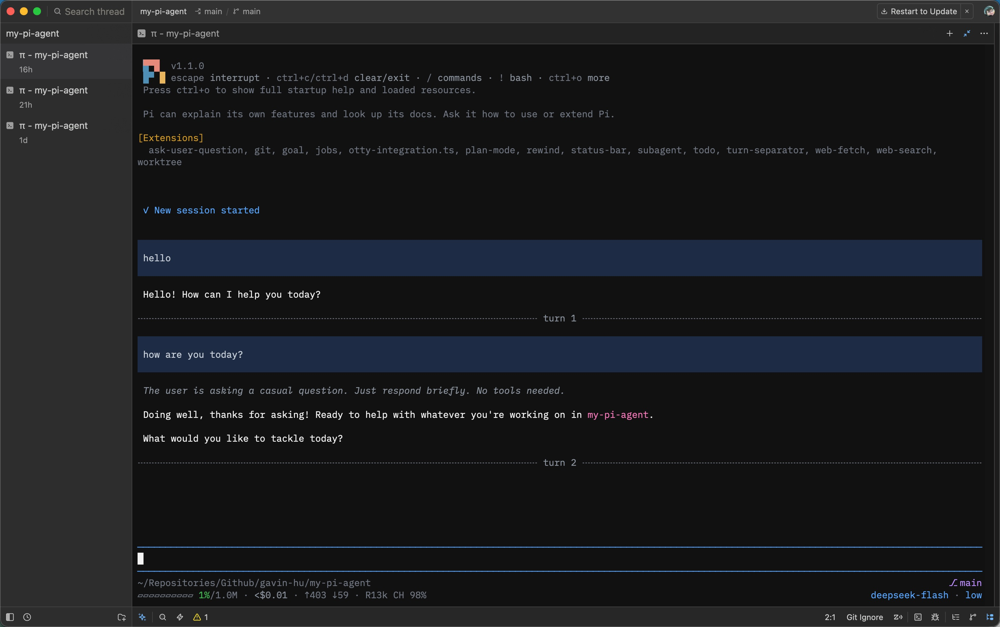

# @gavin-hu/my-pi-agent

[](https://github.com/gavin-hu/my-pi-agent/actions/workflows/ci.yml)
[](./LICENSE)

A personal collection of [Pi](https://pi.dev) customizations, packaged as one
installable Pi package. Pi discovers every extension and theme through the `pi`
manifest in [`package.json`](./package.json), so it loads only what is declared
here.



## Contents

- [Install](#install)
- [What's included](#whats-included)
  - [Themes](#themes)
- [Configuration](#configuration)
  - [Disabling extensions](#disabling-extensions)
- [Development](#development)
  - [Release](#release)
  - [Cross-platform](#cross-platform)
- [Contributing](#contributing)
  - [Tool naming](#tool-naming)
  - [Package conventions](#package-conventions)
- [Changelog](#changelog)
- [License](#license)

## Install

```bash
pi install git:github.com/gavin-hu/my-pi-agent   # from git
pi install ./                                    # personal, from this checkout
pi install ./ -l                                 # project-local (.pi/settings.json)
pi -e .                                          # try it for a single run
```

Requires a working Pi installation. Bun and the dev dependencies are needed
only for the development tasks below.

## What's included

Each extension ships its own `README.md` under its directory with the full tool
and command surface, the Pi integration contract, and design notes.

| Resource | Path | What it does |
|---|---|---|
| Extension | [`extensions/worktree/`](./extensions/worktree/) | `worktree`: isolated `git worktree` lifecycle — `enter_worktree` / `exit_worktree` / `prune_worktrees` / `list_worktrees`, `/worktree*`, and `--worktree <name>`, re-rooting the built-in path tools and guarding escapes. |
| Extension | [`extensions/rewind/`](./extensions/rewind/) | `rewind`: automatic per-prompt snapshots under `refs/pi/rewind` plus `/rewind` to restore code, conversation, or both, and a `↺ N` status chip. |
| Extension | [`extensions/ask-user-question/`](./extensions/ask-user-question/) | `ask_user_question`: ask the user one or more structured questions (labelled options + free-form "Other") and wait for the answer. |
| Extension | [`extensions/todo/`](./extensions/todo/) | `todo`: a TodoWrite-style task list (whole-list replacement, `pending`/`in_progress`/`completed`) with a persistent one-line widget and `/todos`. |
| Extension | [`extensions/goal/`](./extensions/goal/) | `goal`: a persistent session objective (`active`/`achieved`) kept in a one-line widget and restated before each turn; `/goal [text\|clear\|done]`. |
| Extension | [`extensions/plan/`](./extensions/plan/) | `plan`: read-only planning via `enter_plan_mode` / `write_plan` / `exit_plan_mode`; plans are saved to `.pi/plans` and approved before execution (`--plan` to start, `/plan` toggles, `Ctrl+Alt+P`); `subagent` delegation is forced read-only and `powershell` is blocked. |
| Extension | [`extensions/subagent/`](./extensions/subagent/) | `subagent`: delegate a task to a specialized agent (`explorer`, `planner`, `reviewer`, `worker`, `researcher`, `tester`, `debugger`, `documenter`) running in its own `pi` process — single, parallel (max 8/4), or chained via `{previous}`, with optional user/project markdown agents and a `readOnly` mode that passes only reader tools to the child. |
| Extension | [`extensions/job/`](./extensions/job/) | `job`: run long-lived shell commands in the background (`job` tool: start/list/status/logs/kill/wait/clear; `/jobs`; `▸ N` running / `✗ N` unreported-failure chips) with sanitized log tails and shutdown/reconcile lifecycle. |
| Extension | [`extensions/web-access/`](./extensions/web-access/) | `web-access`: web access with two tools — `web_search` (general web search through a pluggable provider: keyless DuckDuckGo by default, optional SearXNG or Brave) and `web_fetch` (GET/POST a URL and read readable text, with paging, `find`, per-hop SSRF checks, and optional PDF/JS support); native `fetch`, one `web-access.json`. |
| Extension | [`extensions/file-browser/`](./extensions/file-browser/) | `file-browser`: `/serve` starts a read-only local HTTP server on a stable port for the session, rooted at the working directory, and opens a two-pane browser tree — listings, file views, image thumbnails, per-language icons, and a filter; `127.0.0.1` only, no dependencies, with a `◉ <port>` status chip. |
| Extension | [`extensions/document/`](./extensions/document/) | `document`: `read_doc` extracts plain text from a local PDF, DOCX, DOC, ODT, RTF, or XLSX through the `pdfcraft-cli` / `wordcraft-cli` / `gridcraft-cli` executables, paged with `startIndex`/`maxChars` and confined to the effective working directory. |
| Extension | [`extensions/memory/`](./extensions/memory/) | `memory`: durable cross-session notes as human-editable markdown — global under the agent directory, project under the repo root's `.pi/` — added, forgotten, or listed with the `memory` tool, injected as a hidden `[MEMORY]` context before each run, and inspected, edited, or cleared with `/memory`. |
| Extension | [`extensions/wechat/`](./extensions/wechat/) | `wechat`: a thin bridge to WeChat over the Weixin iLink bot API — the live Pi session is the agent, so inbound text, images (as model image content), and files (saved and referenced by path) become a user turn and the reply is sent back, with a typing indicator; `/wechat login\|start\|stop\|status\|logout` and the owner-only `send_wechat` tool. |
| Extension | [`extensions/status-bar/`](./extensions/status-bar/) | `status-bar`: a two-line colorful footer — pwd + session name + git branch/worktree + serve chip, then context gauge + usage + mode/alert + model + thinking level; width-adaptive, `/status-bar` toggles it. |
| Extension | [`extensions/turn-separator/`](./extensions/turn-separator/) | `turn-separator`: a labeled dashed line between completed turns — `agent_settled` appends an inert custom entry that an entry renderer draws as `╌╌╌ turn N ╌╌╌`; width-adaptive, TTY-only. |
| Extension | [`extensions/extension-picker/`](./extensions/extension-picker/) | `extension-picker`: `/extensions` lists every resolved Pi extension across all configured packages and enables or disables one (Global or Project settings) by writing `settings.json`; changes apply on reload. |
| Theme | [`themes/nocturne-dark.json`](./themes/nocturne-dark.json) | `nocturne-dark`: a GitHub-inspired dark palette (deep blue-black canvas, cool gray text, blue accent, green/red/yellow status colors, purple/pink operators). |
| Theme | [`themes/nocturne-light.json`](./themes/nocturne-light.json) | `nocturne-light`: the light companion (white canvas, GitHub light accents), for `nocturne-light/nocturne-dark` auto-switching. |

More extensions, skills, and prompts can be added under the conventional
directories and listed in the `pi` manifest.

### Themes

Select `nocturne-dark` or `nocturne-light` through `/settings` → **Theme**, or
use automatic light/dark switching with
`"theme": "nocturne-light/nocturne-dark"` (`pi --use-theme nocturne-dark` for a
one-off). Pi themes cannot set the terminal's background, so the live canvas
stays your terminal's color — set it to `#0d1117` for the intended look. HTML
exports use the theme's `export.pageBg`, so they are unaffected.

## Configuration

Most extensions need no configuration. Those that read settings load
`<agent-dir>/<name>.json` and `<cwd>/.pi/<name>.json`; each extension's
`README.md` lists the keys it accepts.

### Disabling extensions

Every extension in this package is on by default. Set `PI_DISABLED_EXTENSIONS`
to a comma- or whitespace-separated list of extension names to load the package
without them:

```bash
PI_DISABLED_EXTENSIONS=todo,job pi -e .
```

Names are the extension directories under [`extensions/`](./extensions/)
(`worktree`, `rewind`, `ask-user-question`, `todo`, `goal`, `plan`, `subagent`,
`job`, `web-access`, `file-browser`, `document`, `memory`, `status-bar`,
`turn-separator`, `extension-picker`), compared
case-insensitively; unknown names are ignored. This is a package-local switch:
Pi still imports each entrypoint, but a disabled factory registers nothing. To
drop the whole package instead, use Pi's own `--no-extensions` or a settings
`-path` entry.

## Development

```bash
bun install
bun run test         # unit tests (bun test --parallel=4)
bun run test:watch   # unit tests, watch mode
bun run typecheck    # tsc --noEmit
bun run format       # biome format --write .
bun run format:check # biome format . (check only)
bun run transpile    # bun build (--no-bundle) every extension
bun run smoke        # runtime package load + per-extension lifecycle checks (no model call)
bun run check        # format:check + typecheck + transpile + test + smoke
```

AI coding agents should read [`AGENTS.md`](./AGENTS.md) for the repo
conventions and the worktree-based branch flow.

### Release

Distribution is git-only; nothing is published to npm. A release is an
annotated `vX.Y.Z` tag on `main` plus a matching GitHub release whose body is
the changelog section.

1. Work on a branch in a worktree (see [`AGENTS.md`](./AGENTS.md)).
2. Bump `version` in `package.json`, move the `Unreleased` entries in
   [`CHANGELOG.md`](./CHANGELOG.md) under `## [X.Y.Z] - YYYY-MM-DD`, and update
   the link refs at the bottom of that file.
3. Run `bun run check`.
4. Commit as `chore(release): X.Y.Z` and merge the branch into `main`.
5. Tag and push:

   ```bash
   git tag -a vX.Y.Z -m "vX.Y.Z"
   git push origin main && git push origin vX.Y.Z
   ```

6. Create the GitHub release with that changelog section (heading included) as
   its body:

   ```bash
   awk -v h='## [X.Y.Z]' 'index($0,h){p=1} p && /^## \[/ && !index($0,h){exit} p' CHANGELOG.md > section.md
   gh release create vX.Y.Z --title X.Y.Z --notes-file section.md
   rm section.md
   ```

GitHub marks the release with the newest creation date as "Latest", so after
creating a release for an older version use `gh release edit vX.Y.Z --latest`
on the newest tag. Publishing a draft does not change which release is latest.

### Cross-platform

The package and its checks run on Windows, macOS, and Linux; CI runs the full
`bun run check` on all three. `git` must be on `PATH`. Symlink-dependent tests
skip automatically when the host cannot create symlinks (unprivileged Windows
without Developer Mode), so an unprivileged Windows checkout still passes with a
few skips instead of failures.

Extensions are plain TypeScript loaded by Pi through `jiti`, so there is no
build step to run an extension. `@earendil-works/pi-*` and `typebox` are
`peerDependencies` supplied by the Pi host; they are installed as dev
dependencies here only for typechecking and tests.

## Contributing

See [`AGENTS.md`](./AGENTS.md) for the worktree-based branch flow and the
repository invariants. This package follows these contracts:

### Tool naming

Model-facing tools are lowercase `snake_case` and follow Claude Code's
plan/worktree shape:

- A singleton tool is named for its domain: `todo`, `goal`, `job`, `subagent`,
  `memory`.
- A multi-word tool is verb-first: `enter_worktree`, `exit_worktree`,
  `prune_worktrees`, `list_worktrees`, `enter_plan_mode`, `write_plan`,
  `exit_plan_mode`, `ask_user_question`, `read_doc`. The noun-first `web_search`
  and `web_fetch` mirror Claude Code's `WebSearch`/`WebFetch`.
- A name one tool calls through `ctx.executeTool()` lives in
  [`lib/tool-names.ts`](./lib/tool-names.ts), never as a cross-extension import
  (see [`lib/README.md`](./lib/README.md)).
- [`test/naming.test.ts`](./test/naming.test.ts) enforces the shape, uniqueness,
  verb-first ordering, and the reviewed set of names. Built-in overrides
  (`read`/`write`/`edit`/`bash`/`grep`/`find`/`ls`) reuse the built-in names and
  are excluded.

### Package conventions

- `keywords: ["pi-package"]` and a `pi` manifest in `package.json`.
- Host-provided packages (`@earendil-works/pi-*`, `typebox`) stay in
  `peerDependencies` with a `"*"` range, never in `dependencies`.
- Distribution is git-only: users install a tag with
  `pi install git:github.com/gavin-hu/my-pi-agent@vX.Y.Z`. There is no npm
  publish, so `package.json` has no `files` or `publishConfig` field and the
  repository has no `.npmignore`.
- See the
  [Pi Packages docs](https://github.com/earendil-works/pi/blob/main/packages/coding-agent/docs/packages.md).

## Changelog

See [`CHANGELOG.md`](./CHANGELOG.md) for release notes.

## License

MIT
